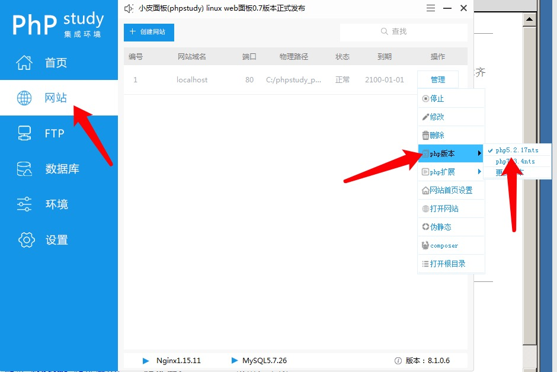
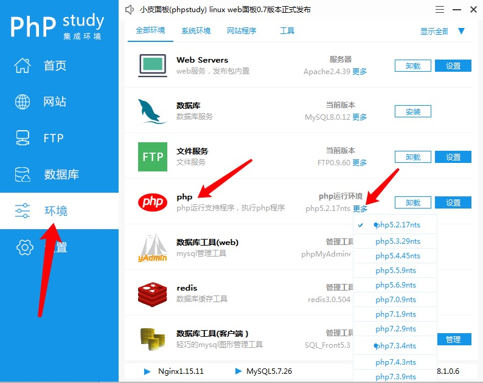
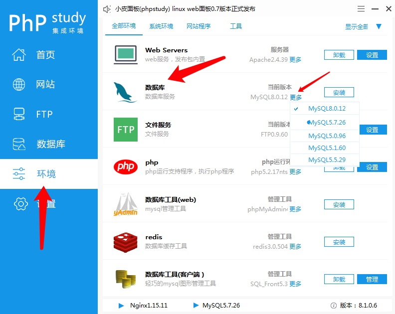
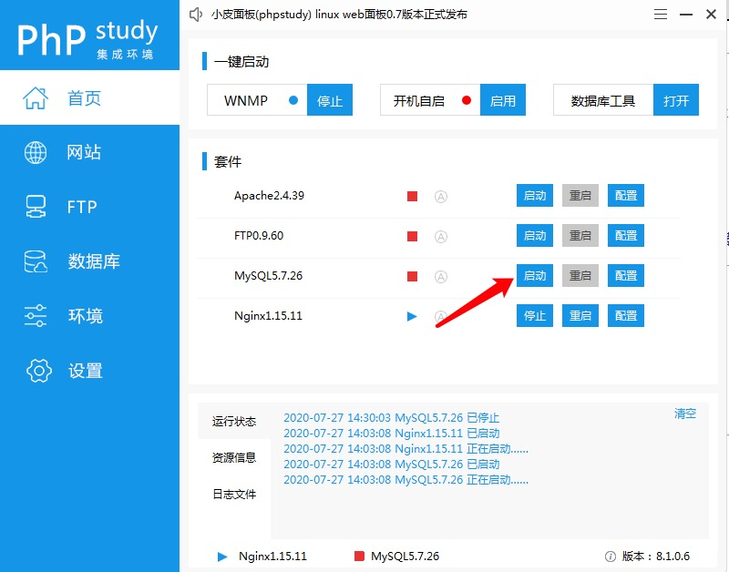
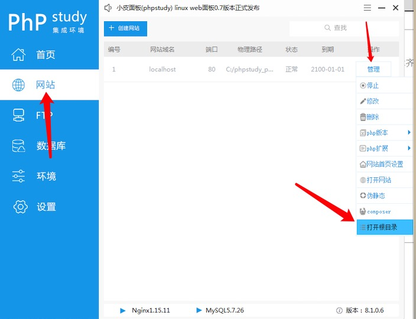
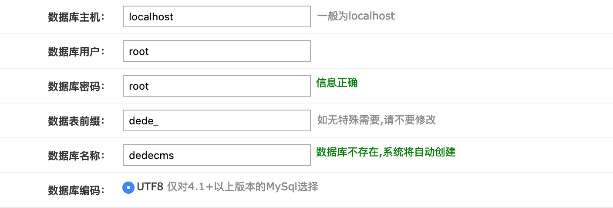
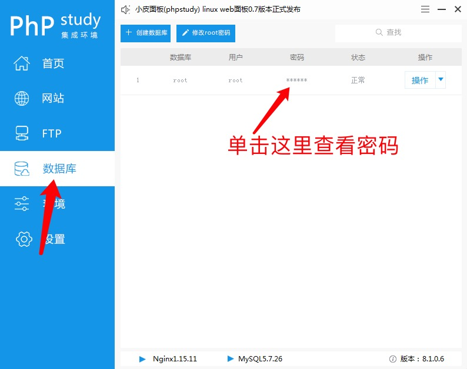
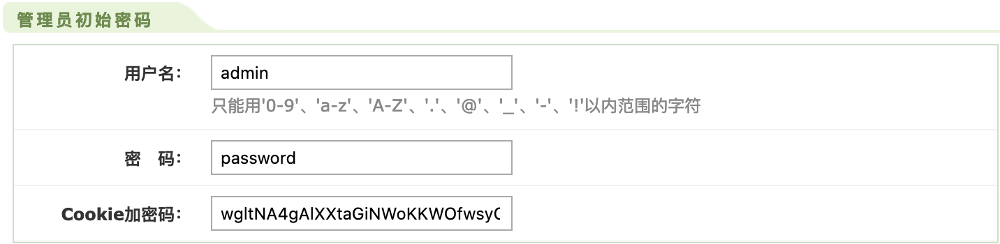
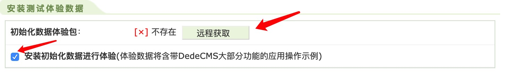

# 使用说明
[toc]
## 1.环境介绍

| 集成环境 | phpStudy_pro       |                                                          |
| -------- | ------------------ | -------------------------------------------------------- |
| 操作系统 | window server 2008 | 如果使用Docker的LAMP环境下有时会出现验证码无法显示的情况 |
| 语言     | php 5.2.17         |                                                          |
| 数据库   | MySQL 5.7.26       |                                                          |

在phpStudy_pro将环境切换为上述配置

### 1.1 php版本切换



如果找不到对应的版本根据下面的截图下载对应的版本



下载了对应的版本后还需要在网站->管理->php版本中将php版本切换到目标版本。

### 1.2 MySQL版本切换



下载了对应版本的MySQL之后还需要在在首页启动MySQL



## 2.安装DedeCMS

  首先将blueCMS的源码放在网站的根目录下，可以通过下面的方式找到网站的根目录



将代码放置到根目录下后，访问对应的路径

```
http://ip/dedecms/uploads/install
```

根据指引完成安装过程



如果不知道连接数据库的用户名和密码，可以在phpstudy中找到



完善管理员管理员信息，点击下一步，会显示空白页面，随后直接访问



管理员用户名和密码请务必牢记，为了让页面更真实，可以勾选


以上便完成安装

## 3.相关地址

### 3.1 后台地址
```
http://192.168.25.176/dedecms/uploads/dede
```
### 3.2 首页地址
```
http://192.168.25.176/dedecms/uploads/
```
